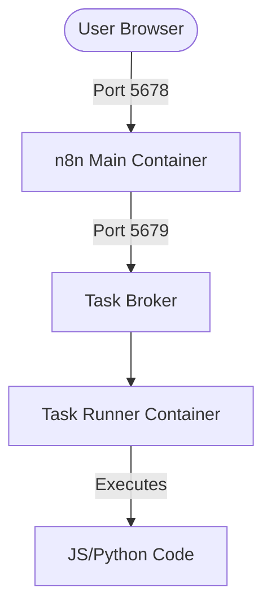

# n8n with External Task Runners

This repository contains a customized **n8n** deployment optimized for security and scale using **External Task Runners**. It allows for isolated execution of JavaScript and Python code blocks.

---

## 🚀 Key Features

- **Isolated Execution**: Code blocks run in a separate container, shielding the main n8n process.
- **Customized Python Environment**: Pre-loaded with `pandas` and `numpy`.
- **Media Support**: `ffmpeg` is included in the main container for video/audio processing.
- **Integrated ngrok**: Automatic tunneling for webhooks without manual installation.
- **Dockerized**: Easy to deploy and manage with Docker Compose.

---

## 🏗️ Architecture Overview

Unlike a standard n8n deployment where code in the "Code Node" runs inside the main application process, this setup uses **External Task Runners**.

### Component Diagram



1.  **n8n Main Container**: Handles the UI, workflow logic, and node execution. It exposes the dashboard on port `5678`.
2.  **Task Broker**: An internal service (on port `5679`) that acts as a middleman. When a workflow needs to run code, it sends the task here instead of executing it locally.
3.  **Task Runner Container**: A separate container that polls the Broker for tasks. It executes the JavaScript or Python code in an isolated environment and returns the results.
4.  **Code Execution**: The actual execution happens in the Runner, ensuring that heavy computations or crashes in your code don't affect the stability of the main n8n application.

---

## 📁 Project Structure

- **[docker-compose.yml](./docker-compose.yml)**: Orchestrates n8n, the task-runner, and ngrok services.
- **[Dockerfile.n8n](./Dockerfile.n8n)**: Custom image for the main n8n application (includes `ffmpeg` and local Python libs).
- **[Dockerfile.runners](./Dockerfile.runners)**: Custom image for the external task runners (includes `uv` and specific data science libs).
- **[n8n-task-runners.json](./n8n-task-runners.json)**: Configuration for JS and Python runner environments, specifying allowed libraries and environment variables.

---

## 🛠️ Setup & Installation

### 1. Prerequisites
Create a `.env` file in the root directory.

```bash
touch .env
```

Then, edit `.env` and define your variables:
- `N8N_RUNNERS_AUTH_TOKEN`: A secure random secret shared between the app and runner.
- `WEBHOOK_URL`: Your public-facing URL (provided by ngrok).
- `N8N_HOST`: Your public domain or localhost.
- `NGROK_AUTHTOKEN`: Your ngrok authtoken (get it from the [ngrok dashboard](https://dashboard.ngrok.com/)).

### 2. Build the Images
Build both the application and runner containers:

```bash
docker compose build
```

### 3. Start the Containers
Launch the services in detached mode:

```bash
docker compose up -d
```

---

## 🌐 External Access (ngrok)

This setup includes an integrated **ngrok** container to make n8n accessible from the internet for webhooks.

### 1. Setup ngrok
1.  Add your ngrok authtoken to the `.env` file as `NGROK_AUTHTOKEN`.
2.  Start the services: `docker compose up -d`.

### 2. Update n8n Configuration
1.  Check the ngrok logs to find your public URL:
    ```bash
    docker logs n8n-ngrok-1
    ```
    (Or check the ngrok dashboard).
2.  Copy the forwarding URL (e.g., `https://abc-123.ngrok-free.app`).
3.  Update your `WEBHOOK_URL` and `N8N_HOST` in `.env`:
    ```env
    WEBHOOK_URL=https://abc-123.ngrok-free.app/
    N8N_HOST=abc-123.ngrok-free.app
    ```
4.  Restart the containers to apply the changes:
    ```bash
    docker compose up -d
    ```

---

## ⚙️ Configuration & Customization

### Python Dependencies
To add more Python libraries:
1.  Modify `Dockerfile.runners` to include the library in the `uv pip install` command.
2.  Update the `N8N_RUNNERS_EXTERNAL_ALLOW` list in `n8n-task-runners.json` to permit its import.

### Security (Environment Access)
The setup is configured with `N8N_BLOCK_ENV_ACCESS_IN_NODE=true`. Only variables explicitly listed in `n8n-task-runners.json` under `allowed-env` are accessible within code nodes.

---

## 🔍 Troubleshooting

### Missing Auth Token
If you see `Error: Missing auth token` in the logs, ensure `N8N_RUNNERS_AUTH_TOKEN` is set in your `.env` file AND that you have restarted the containers.

### Viewing Logs
- **Main App**: `docker logs -f n8n-main`
- **Runners**: `docker logs -f runner`
- **ngrok**: `docker logs -f n8n-ngrok-1` (Note: Container name might vary based on project folder)
